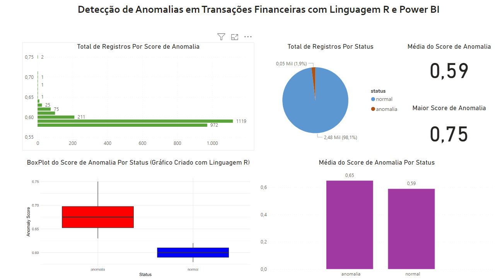

# 💳 Detecção de Anomalias em Transações Financeiras com R e Power BI

Este projeto envolve a criação de um dashboard de detecção de anomalias em transações financeiras, utilizando a Linguagem R e Power BI. Com um conjunto de dados fictícios, foi possível realizar a análise de transações ao longo dos anos e identificar possíveis anomalias. O processo foi implementado diretamente no Power BI, utilizando scripts em R para visualização e modelagem.

## 📑 Sumário
- [Objetivo do Projeto](#objetivo-do-projeto)
- [Ferramentas Utilizadas](#ferramentas-utilizadas)
- [Estrutura do Dashboard](#estrutura-do-dashboard)
- [Detecção de Anomalias](#detecção-de-anomalias)
- [Conclusão](#conclusão)

### 🎯 Objetivo do Projeto
O objetivo principal deste projeto é detectar anomalias em transações financeiras utilizando um modelo treinado na Linguagem R e exibir os resultados diretamente no Power BI.

Perguntas que o dashboard responde:
1. ❓ **Existem transações que se destacam significativamente das demais?**
2. 📊 **Qual a distribuição das transações por faixa etária e turno de trabalho?**
3. 🚨 **Quais são as transações suspeitas de serem anomalias?**

### 🛠️ Ferramentas Utilizadas
- **Microsoft Power BI**: Utilizado para criar o dashboard e integrar scripts em R.
- **R**: Utilizado para análise e modelagem de dados, com foco na detecção de anomalias.
- **Bibliotecas R**:
  - **tidyverse**: Conjunto de pacotes para manipulação de dados.
  - **dplyr**: Pacote para filtragem e transformação dos dados.
  - **solitude**: Utilizado para construir modelos de detecção de anomalias.
  - **ggplot2**: Usado para criar gráficos de visualização dos dados, como o boxplot.
  - **readr**: Para leitura e manipulação de arquivos CSV.

### 🗂️ Estrutura do Dashboard
O dashboard foi projetado para fornecer uma visão clara das transações financeiras ao longo do tempo, destacando possíveis anomalias e permitindo uma investigação mais aprofundada.

#### 🚨 Detecção de Anomalias em Transações
- **Boxplot de Transações**: Um gráfico boxplot foi criado com a Linguagem R e exibido no Power BI, mostrando a distribuição das transações ao longo dos anos, com ênfase em outliers que podem ser considerados anomalias.
- **Modelo de Detecção de Anomalias**: Um modelo de detecção foi treinado usando a biblioteca `solitude` para identificar possíveis anomalias, com base no histórico de transações.
- **Análise por Faixa Etária e Turno**: A produção foi segmentada por faixa etária (16 a 19, 20 a 24, 25 a 34, 35 a 44, 45 a 54, 55 a 64, acima de 65) e turno (manhã e tarde) para entender melhor o comportamento das transações.

#### 📂 Dados e Scripts
Os arquivos relacionados ao projeto estão na pasta `Data`:
- **Dataset CSV**: Arquivo contendo os dados fictícios de transações financeiras.
- **Script R**: Código em R utilizado para gerar o modelo de anomalias e o gráfico de boxplot.
- **Resultado da Análise**: Arquivo Excel com o resultado das análises e visualizações.

### 🔍 Conclusão
O Dashboard de Detecção de Anomalias em Transações Financeiras oferece uma poderosa ferramenta para identificar padrões incomuns e comportamentos anômalos em grandes volumes de transações. A combinação de R e Power BI permite uma análise robusta e eficiente, com visualizações claras e insights valiosos para o monitoramento financeiro.

