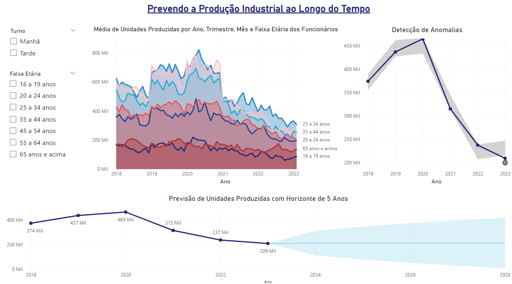

# 🏭 Dashboard de Previsão da Produção Industrial: 2018 - 2028

Este projeto envolve a criação de um dashboard para prever a produção industrial ao longo do tempo, utilizando dados históricos de unidades produzidas entre 2018 e 2023. A análise é segmentada por turnos (manhã e tarde) e faixas etárias dos trabalhadores, permitindo identificar tendências de produção e detectar anomalias. Com base nesses dados, foram feitas previsões para os anos de 2024 a 2028.

## 📑 Sumário
- [Objetivo do Projeto](#objetivo-do-projeto)
- [Ferramentas Utilizadas](#ferramentas-utilizadas)
- [Estrutura do Dashboard](#estrutura-do-dashboard)
- [Previsão da Produção Industrial](#previsão-da-produção-industrial)
- [Detecção de Anomalias](#detecção-de-anomalias)
- [Conclusão](#conclusão)

### 🎯 Objetivo do Projeto
O objetivo principal deste projeto é criar um dashboard que forneça respostas para as seguintes perguntas de negócio:

1. 📊 **Qual a tendência de produção por turno entre 2018 e 2023?**
2. 🕒 **Como se comporta a produção por faixa etária em cada turno?**
3. 🔮 **Quais são as previsões de produção para os anos de 2024 a 2028?**
4. ❗ **Houve anomalias detectadas na produção ao longo do tempo?**

### 🛠️ Ferramentas Utilizadas
- **Microsoft Power BI**: Para a construção e visualização do dashboard.
- **Microsoft Excel e CSV**: Arquivos contendo os dados históricos de produção entre 2018 e 2023, por turnos e faixas etárias.
- **DAX (Data Analysis Expressions)**: Utilizado para criar medidas e cálculos de previsão e anomalias no Power BI.
- **ETL (Extract, Transform, Load)**: Processo realizado no Power BI para preparar e modelar os dados de produção.

### 🗂️ Estrutura do Dashboard
O dashboard foi construído com o intuito de oferecer uma visão clara sobre o comportamento da produção industrial, tendências ao longo dos anos, previsões futuras, e detecção de anomalias.

#### 📊 Previsão da Produção Industrial
- **Tendência de Produção Por Turno**: Gráfico de linhas mostrando a produção total por turno (manhã e tarde) de 2018 a 2023, destacando possíveis variações ao longo dos anos.
- **Produção Por Faixa Etária**: Gráficos que dividem a produção de cada turno nas seguintes faixas etárias: 16 a 19, 20 a 24, 25 a 34, 35 a 44, 45 a 54, 55 a 64 e acima de 65 anos.
- **Previsões de Produção (2024-2028)**: Gráfico projetando as unidades de produção esperadas para os próximos anos, de acordo com a tendência histórica.
  
#### 🚨 Detecção de Anomalias
- **Análise de Anomalias**: Indicadores e gráficos destacando pontos fora da curva na produção ao longo dos anos, utilizando técnicas de detecção de anomalias para identificar quedas ou picos inesperados.

#### 🎓 Sobre o Projeto
Este projeto foi desenvolvido com dados fictícios para simular o comportamento da produção industrial ao longo do tempo, com o objetivo de aprimorar habilidades de previsão e análise de anomalias em dados industriais.

### 🔍 Conclusão
O Dashboard de Previsão da Produção Industrial fornece uma visão estratégica da produção ao longo de uma década, permitindo uma melhor alocação de recursos e identificação de potenciais gargalos. A detecção de anomalias ajuda a prever possíveis desvios e a tomar decisões mais informadas para otimizar a produção.
