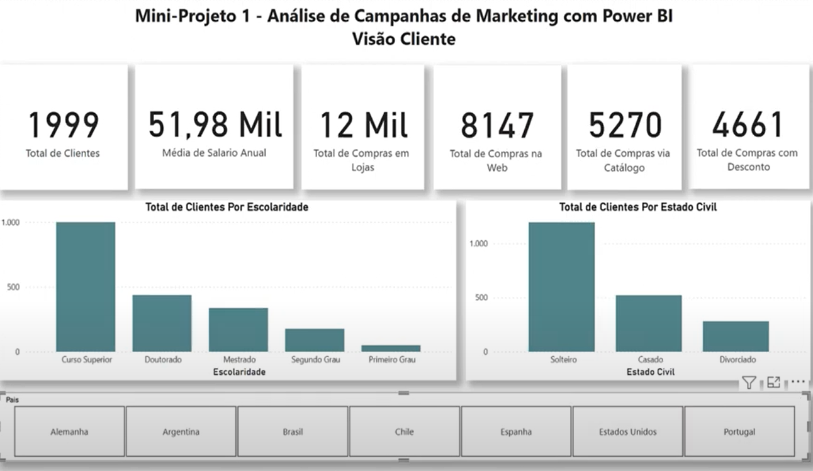

# 📊 Dashboard de Análise de Clientes e Performance de Marketing

Este projeto consiste na criação de um dashboard abrangente, que visa oferecer uma visão completa sobre o perfil dos clientes, os padrões de compra e a efetividade das campanhas de marketing. O dashboard foi desenvolvido utilizando o Microsoft Power BI, permitindo aos tomadores de decisão explorar os dados e obter insights valiosos sobre o comportamento de compra e a performance das campanhas.

## 📑 Sumário
- [Objetivo do Projeto](#objetivo-do-projeto)
- [Ferramentas Utilizadas](#ferramentas-utilizadas)
- [Estrutura do Dashboard](#estrutura-do-dashboard)
- [Visão do Cliente](#visão-do-cliente)
- [Visão do Comportamento de Compra do Cliente](#visão-do-comportamento-de-compra-do-cliente)
- [Visão da Performance das Campanhas de Marketing](#visão-da-performance-das-campanhas-de-marketing)
- [Visão dos Padrões de Compra no Ponto de Venda (País)](#visão-dos-padrões-de-compra-no-ponto-de-venda-país)
- [Conclusão](#conclusão)

### 🎯 Objetivo do Projeto
O objetivo principal deste projeto é desenvolver um dashboard que forneça uma visão detalhada sobre:

1. 👥 **Visão do Cliente**: Perfil demográfico e características principais dos clientes.
2. 🛒 **Visão do Comportamento de Compra do Cliente**: Análise dos padrões de compra, incluindo frequência de compra, produtos mais adquiridos, e canais de compra preferidos.
3. 📈 **Visão da Performance das Campanhas de Marketing**: Avaliação da efetividade das campanhas de marketing, medindo o retorno sobre investimento (ROI), taxa de conversão e impacto nas vendas.
4. 🌍 **Visão dos Padrões de Compra no Ponto de Venda (País)**: Identificação de tendências de compra em diferentes regiões e mercados, permitindo uma análise geográfica detalhada.

### 🛠️ Ferramentas Utilizadas
- **Microsoft Power BI**: Utilizado para a construção e visualização do dashboard.
- **Microsoft Excel**: Arquivo no formato `.csv` contendo os dados de Compras de Clientes.
- **DAX (Data Analysis Expressions)**: Utilizado para criar cálculos e medidas no Power BI.
- **ETL (Extract, Transform, Load)**: Processo realizado diretamente no Power BI para transformar e modelar os dados.

### 🗂️ Estrutura do Dashboard
O dashboard foi estruturado em quatro visões principais:

#### 👥 Visão do Cliente
- **Perfil Demográfico**: Gráfico de barras mostrando a distribuição por faixa etária e gênero.
- **Segmentação de Clientes**: Gráfico de rosca destacando os principais segmentos de mercado.
- **Fidelidade do Cliente**: Indicadores de retenção e fidelidade ao longo do tempo.

#### 🛒 Visão do Comportamento de Compra do Cliente
- **Frequência de Compra**: Gráfico de linha mostrando a frequência de compras por cliente ao longo do tempo.
- **Produtos Mais Adquiridos**: Gráfico de barras destacando os produtos mais populares.
- **Canais de Compra Preferidos**: Gráfico de radar mostrando a distribuição das compras por canal (online, loja física, etc.).

#### 📈 Visão da Performance das Campanhas de Marketing
- **Taxa de Conversão das Campanhas**: Gráfico de colunas mostrando a taxa de conversão para cada campanha de marketing.
- **ROI das Campanhas**: Indicadores de ROI por campanha, permitindo identificar quais campanhas foram mais eficazes.
- **Impacto nas Vendas**: Gráfico de linha mostrando a variação nas vendas durante o período das campanhas.

#### 🌍 Visão dos Padrões de Compra no Ponto de Venda (País)
- **Distribuição Geográfica das Vendas**: Mapa de calor mostrando as regiões com maior volume de vendas.
- **Preferências Regionais de Produto**: Gráfico treemap mostrando os produtos mais vendidos por região.
- **Análise de Mercado**: Gráficos que cruzam dados de vendas com demografia e outras variáveis regionais.

#### 🎓 Sobre o Curso
Este projeto é parte do curso [Microsoft Power BI Para Business Intelligence e Data Science oferecido pela Data Science Academy](https://www.datascienceacademy.com.br/course/microsoft-power-bi-para-business-intelligence-e-data-science). O curso é voltado para profissionais que desejam aprimorar suas habilidades em Business Intelligence e Data Science utilizando o Microsoft Power BI.

### 🔍 Conclusão
O Dashboard de Análise de Clientes e Performance de Marketing oferece uma ferramenta poderosa para entender melhor o perfil dos clientes, os padrões de compra e a eficácia das campanhas de marketing. Ele permite uma análise detalhada e personalizada, facilitando a tomada de decisões estratégicas com base em dados concretos e visualizações interativas.
