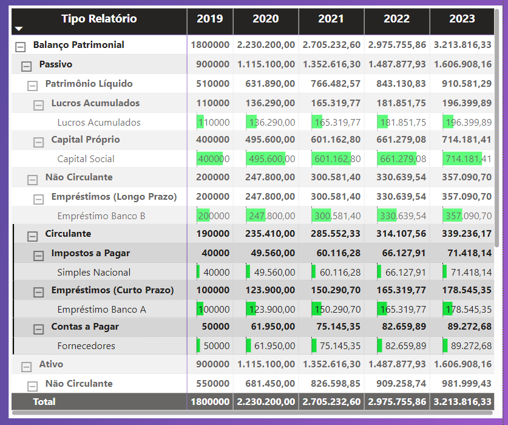

# 📊 Dashboard de Balanço Patrimonial: Ativos, Passivos e Patrimônio Líquido

Este projeto consiste na criação de um dashboard para o setor contábil, focado na análise do Balanço Patrimonial da empresa. O objetivo é fornecer uma visão consolidada e detalhada dos Ativos, Passivos e Patrimônio Líquido, permitindo que todas as informações sejam visualizadas em um único local de forma organizada e acessível.

## 📑 Sumário
- [Objetivo do Projeto](#objetivo-do-projeto)
- [Ferramentas Utilizadas](#ferramentas-utilizadas)
- [Estrutura do Dashboard](#estrutura-do-dashboard)
- [Análise do Balanço Patrimonial](#análise-do-balanço-patrimonial)
- [Conclusão](#conclusão)

### 🎯 Objetivo do Projeto
O objetivo principal deste projeto é desenvolver um dashboard que apresente de forma clara e estruturada os seguintes elementos do Balanço Patrimonial:

1. 🏦 **Ativos**: Todos os bens e direitos que a empresa possui.
2. 💼 **Passivos**: Todas as obrigações e dívidas da empresa.
3. 📊 **Patrimônio Líquido**: A diferença entre os ativos e passivos, representando o valor líquido da empresa.

A apresentação dos dados foi feita em forma de Matriz, de modo que todas as informações essenciais estejam disponíveis em um único local, facilitando a análise e a tomada de decisões.

### 🛠️ Ferramentas Utilizadas
- **Microsoft Power BI**: Utilizado para a construção e visualização do dashboard em formato de matriz.
- **Microsoft Excel e CSV**: Arquivos nos formatos `.csv` contendo os dados financeiros da empresa, incluindo Ativos, Passivos e Patrimônio Líquido.
- **DAX (Data Analysis Expressions)**: Utilizado para criar cálculos e medidas no Power BI.
- **ETL (Extract, Transform, Load)**: Processo realizado diretamente no Power BI para transformar e modelar os dados.

### 🗂️ Estrutura do Dashboard
O dashboard foi estruturado em formato de Matriz, permitindo a visualização consolidada de todos os componentes do Balanço Patrimonial:

#### 🏦 Análise do Balanço Patrimonial
- **Ativos**: A matriz mostra a composição detalhada dos ativos da empresa, divididos em Ativos Circulantes (como caixa e equivalentes, contas a receber, estoques) e Ativos Não Circulantes (como imóveis, investimentos de longo prazo, ativos intangíveis).
- **Passivos**: A matriz inclui todas as obrigações da empresa, tanto Passivos Circulantes (como contas a pagar, empréstimos de curto prazo) quanto Passivos Não Circulantes (como financiamentos de longo prazo, provisões).
- **Patrimônio Líquido**: A matriz exibe o valor do patrimônio líquido da empresa, incluindo capital social, reservas e lucros acumulados.

#### 🔍 Visão Consolidada
O formato de matriz permite que todas essas informações sejam exibidas lado a lado, facilitando a comparação e a análise detalhada. A estrutura clara e organizada ajuda a visualizar o equilíbrio entre ativos e passivos, e como isso impacta o patrimônio líquido da empresa.

#### 🎓 Sobre o Curso
Este projeto é parte do curso [Microsoft Power BI Para Business Intelligence e Data Science oferecido pela Data Science Academy](https://www.datascienceacademy.com.br/course/microsoft-power-bi-para-business-intelligence-e-data-science). O curso é voltado para profissionais que desejam aprimorar suas habilidades em Business Intelligence e Data Science utilizando o Microsoft Power BI.

### 🔍 Conclusão
O Dashboard de Balanço Patrimonial oferece uma ferramenta poderosa para a análise financeira da empresa, consolidando todas as informações de ativos, passivos e patrimônio líquido em um único local. A apresentação em formato de matriz permite uma visão clara e detalhada, essencial para a tomada de decisões estratégicas e o monitoramento da saúde financeira da empresa.

