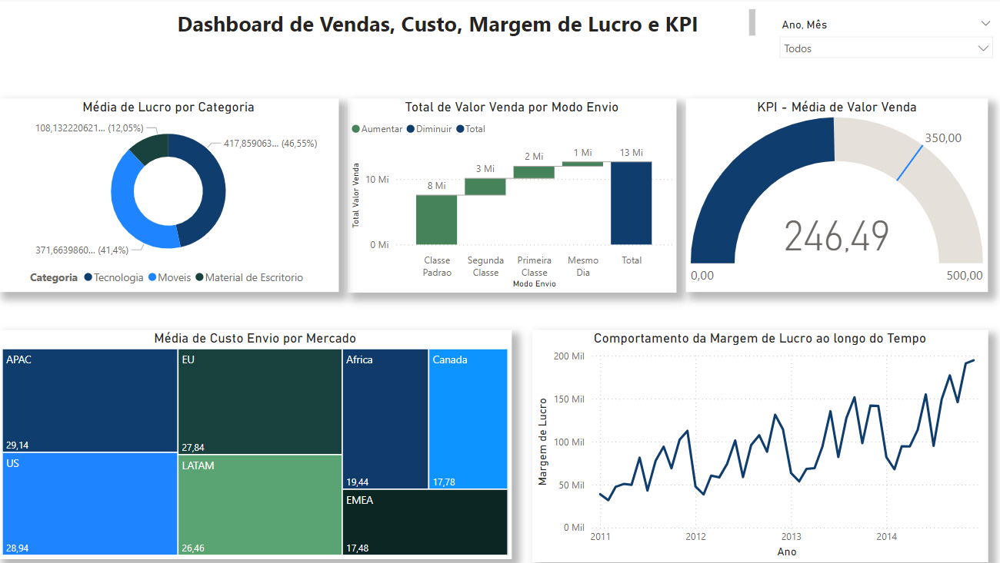

# 📊 Dashboard de Vendas, Custo, Margem de Lucro e KPI

Este projeto consiste na criação de um dashboard de vendas, custos, margens de lucro e KPIs utilizando o Microsoft Power BI. O objetivo é responder a perguntas-chave relacionadas ao desempenho financeiro e operacional da empresa, permitindo aos usuários explorar e analisar os dados para obter insights valiosos.

## 📑 Sumário
- [Objetivo do Projeto](#objetivo-do-projeto)
- [Ferramentas Utilizadas](#ferramentas-utilizadas)
- [Estrutura do Dashboard](#estrutura-do-dashboard)
- [Dataset](#dataset)
- [Sobre o Curso](#sobre-o-curso)
- [Conclusão](#conclusão)

#### 🎯 Objetivo do Projeto
O objetivo principal deste projeto é desenvolver um dashboard que responda às seguintes perguntas de negócio:

1. 📈 **Qual foi o total de valor venda considerando cada modo de envio dos pedidos?** 
   - Resposta apresentada em um gráfico de cascata.
2. 🌍 **Quais mercados tiveram o maior custo médio de envio dos produtos vendidos?**
   - Resposta apresentada em um gráfico treemap.
3. 🎯 **A empresa tem como objetivo (meta) manter uma média de 350 para o valor de venda todos os meses. Mostre um indicador (KPI–Key Performance Indicator) com o valor médio de venda. A empresa ficou abaixo ou acima da meta no mês de Abril/2014?**
4. 💸 **Considere que o lucro é equivalente a: valor venda - custo envio. Qual categoria de produto apresentou maior lucro médio?**
5. 📉 **Qual foi o comportamento da margem de lucro ao longo do tempo?**
   - Considere a margem de lucro como o lucro dividido pelo valor de venda.

Além disso, o dashboard permitirá que os usuários filtrem os dados por ano, por segmento de mercado e por país, oferecendo uma visão personalizada e detalhada das vendas.

#### 🛠️ Ferramentas Utilizadas
- **Microsoft Power BI**: Utilizado para a construção e visualização do dashboard.
- **Microsoft Excel e CSV**: Arquivos nos formatos `.csv` contendo os dados de Clientes, Pedidos, Produtos e Vendas.
- **DAX (Data Analysis Expressions)**: Utilizado para criar cálculos e medidas no Power BI.
- **ETL (Extract, Transform, Load)**: Processo realizado diretamente no Power BI para transformar e modelar os dados.

#### 🗂️ Estrutura do Dashboard
O dashboard foi estruturado para ser intuitivo e fácil de navegar. Ele contém:

- **Total de Vendas por Modo de Envio**: Gráfico de cascata que demonstra o valor total vendido por cada modo de envio.
- **Custo Médio de Envio por Mercado**: Gráfico treemap que mostra os mercados com maior custo médio de envio.
- **Indicador KPI**: Um indicador de desempenho chave que compara o valor médio de venda com a meta estabelecida.
- **Análise de Lucro por Categoria de Produto**: Gráfico que apresenta a categoria de produto com maior lucro médio.
- **Comportamento da Margem de Lucro ao Longo do Tempo**: Gráfico de linha que mostra a evolução da margem de lucro ao longo do tempo.

#### 📊 Dataset
O dataset utilizado contém informações detalhadas sobre clientes, pedidos, produtos e vendas, incluindo:

- 📅 Data do Pedido
- 🆔 ID do Cliente
- 🚚 Modo de Envio
- 🌍 Mercado
- 🏷️ Categoria do Produto
- 🛒 Valor de Venda
- 💵 Custo de Envio
- 💸 Lucro

Esses dados foram modelados e transformados diretamente no Power BI, utilizando técnicas de ETL e cálculos DAX para criar medidas e colunas calculadas.

#### 🎓 Sobre o Curso
Este projeto é parte do curso [Microsoft Power BI Para Business Intelligence e Data Science oferecido pela Data Science Academy](https://www.datascienceacademy.com.br/course/microsoft-power-bi-para-business-intelligence-e-data-science). O curso é voltado para profissionais que desejam aprimorar suas habilidades em Business Intelligence e Data Science utilizando o Microsoft Power BI.

#### 🔍 Conclusão
O Dashboard de Vendas, Custo, Margem de Lucro e KPI foi desenvolvido para fornecer insights valiosos sobre o desempenho financeiro e operacional da empresa. Ele oferece uma ferramenta poderosa para a tomada de decisões informadas, baseada em dados detalhados e visualizações interativas.
