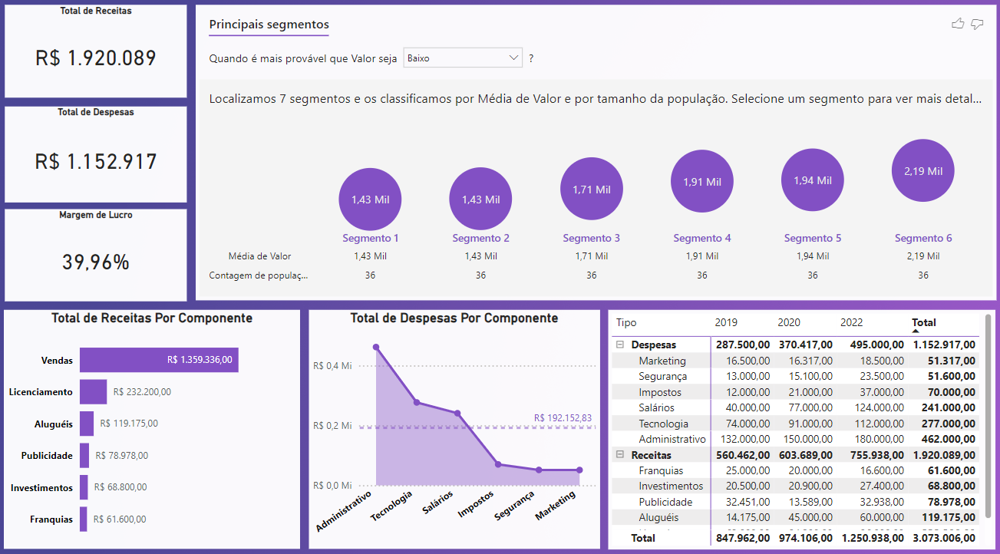

# 💰 Dashboard Financeiro: Análise de Indicadores Financeiros

Este projeto envolve a criação de um dashboard para o setor financeiro, focado em indicadores essenciais como receitas, despesas, e margem de lucro. O objetivo é fornecer uma visão abrangente do desempenho financeiro da empresa, permitindo a identificação de áreas de maior e menor impacto, para apoiar a tomada de decisões estratégicas.

## 📑 Sumário
- [Objetivo do Projeto](#objetivo-do-projeto)
- [Ferramentas Utilizadas](#ferramentas-utilizadas)
- [Estrutura do Dashboard](#estrutura-do-dashboard)
- [Análise de Indicadores Financeiros](#análise-de-indicadores-financeiros)
- [Conclusão](#conclusão)

### 🎯 Objetivo do Projeto
O objetivo principal deste projeto é desenvolver um dashboard que responda às seguintes perguntas de negócio:

1. 💵 **Qual o total de receitas?**
2. 💸 **Qual o total de despesas?**
3. 📈 **Qual a margem de lucro?**
4. 📊 **Qual o total de receitas por componente?**
5. 📉 **Qual o total de despesas por componente em relação à média de despesas?**
6. 🔍 **Qual o total de receitas e despesas por componente e por ano, com a hierarquia Tipo/Componente?**

Além disso, a empresa precisa identificar os segmentos onde receitas e despesas são maiores e menores, para traçar seu plano estratégico.

### 🛠️ Ferramentas Utilizadas
- **Microsoft Power BI**: Utilizado para a construção e visualização do dashboard.
- **Microsoft Excel**: Arquivos nos formatos `.xlxs` contendo os dados financeiros, incluindo receitas, despesas, e componentes.
- **DAX (Data Analysis Expressions)**: Utilizado para criar cálculos e medidas no Power BI.
- **ETL (Extract, Transform, Load)**: Processo realizado diretamente no Power BI para transformar e modelar os dados.

### 🗂️ Estrutura do Dashboard
O dashboard foi estruturado para fornecer uma visão clara e detalhada sobre os principais indicadores financeiros:

#### 💵 Análise de Indicadores Financeiros
- **Total de Receitas**: Cartão simples exibindo o valor total das receitas geradas pela empresa.
- **Total de Despesas**: Cartão simples mostrando o valor total das despesas incorridas.
- **Margem de Lucro**: Indicador calculado com base na fórmula: (Receitas - Despesas) / Receitas, exibido como um percentual.
- **Total de Receitas Por Componente**: Gráfico de barras ou colunas mostrando o total de receitas geradas por cada componente financeiro (e.g., produto, serviço, etc.).
- **Total de Despesas Por Componente em Relação à Média de Despesas**: Gráfico comparativo que mostra as despesas por componente, destacando aqueles acima ou abaixo da média.
- **Total de Receitas e Despesas Por Componente e Por Ano**: Gráfico hierárquico (e.g., tree map ou barra empilhada) que permite a visualização das receitas e despesas por componente e por ano, categorizado por Tipo/Componente.

#### 🔍 Análise Segmentada
Além dos gráficos mencionados, o dashboard inclui visualizações que permitem a identificação dos segmentos com as maiores e menores receitas e despesas, ajudando a empresa a traçar seu plano estratégico com base em dados precisos.

#### 🎓 Sobre o Curso
Este projeto é parte do curso [Microsoft Power BI Para Business Intelligence e Data Science oferecido pela Data Science Academy](https://www.datascienceacademy.com.br/course/microsoft-power-bi-para-business-intelligence-e-data-science). O curso é voltado para profissionais que desejam aprimorar suas habilidades em Business Intelligence e Data Science utilizando o Microsoft Power BI.

### 🔍 Conclusão
O Dashboard Financeiro fornece uma visão abrangente do desempenho econômico da empresa, permitindo uma análise detalhada de receitas, despesas, e margem de lucro. Através de segmentações e hierarquias, a empresa pode identificar as áreas de maior e menor impacto, facilitando a tomada de decisões estratégicas fundamentadas.
